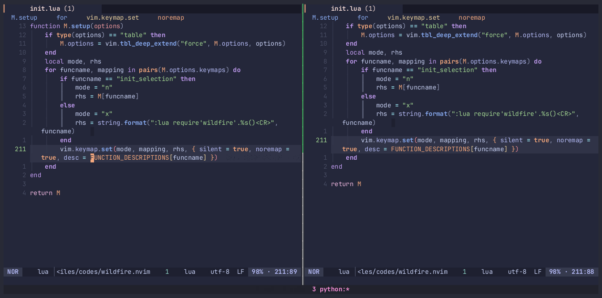

# 🔥Wildfire.nvim: Wildfire burns treesitter🌲

A modern successor to
[wildfire.vim](https://github.com/gcmt/wildfire.vim), empowered with the
superpower of treesitter.

<div>

<table>
<colgroup>
<col style="width: 100%" />
</colgroup>
<tbody>
<tr class="odd">
<td style="text-align: center;"><div width="100.0%"
data-layout-align="center" data-fig.extended="false">
<p><a href="https://asciinema.org/a/TKD1XZ85IAtN0m5JwlvinRIZP"></a></p>
<p>Incremental and decremental selection</p>
</div></td>
</tr>
</tbody>
</table>

<table>
<colgroup>
<col style="width: 50%" />
<col style="width: 50%" />
</colgroup>
<tbody>
<tr class="odd">
<td style="text-align: center;"><div width="50.0%"
data-layout-align="center">
<p></p>
</div></td>
<td style="text-align: center;"><div width="50.0%"
data-layout-align="center">
<p></p>
</div></td>
</tr>
</tbody>
</table>

</div>

## Highlights

- ⚡ Smartly select the **inner** part of texts
- ⚫ **count prefix**
- 🌳 **Treesitter Integration**

## Motivation

I’ve found that treesitter’s
[`incremental_selection`](https://www.reddit.com/r/neovim/comments/r10llx/the_most_amazing_builtin_feature_nobody_ever/)
is particularly handy for text selection. It often allows for selecting
the desired text with fewer keystrokes compared to a well-configured
wildfire.vim, all without the need to set up intricate text objects.

However, since treesitter relies solely on AST for incremental
selection, it tends to be overly **aggressive** for surrounds. In such
case, I havt to revert to using text objects for selection, which is
annoyed and tripped me up in practical use.

On the other hand, treesitter doesn’t support the
`count prefix(vim.v.count)`, which can make it somewhat cumbersome when
dealing with longer ranges. Its implementation is also a bit buggy, as
you might select an area within the same range(see below).

> A picture is worth a thousand words



## Usage

The useage is almost the same as
[wildfire.vim](https://github.com/gcmt/wildfire.vim) and
[`incremental_selection`](https://www.reddit.com/r/neovim/comments/r10llx/the_most_amazing_builtin_feature_nobody_ever/),
You can check out their introduction to get a sense of it.

- `CR` Init selection and do incremental selection if you have
  initilized (so just keep pressing `CR`).
- `BS` Decremental selection.
- `NUM-CR` Accelerate selection with count prefix.

This plugin offers a streamlined method for text selection, freeing you
from the hassle of configuring and remembering intricate text objects.
Plus, initiating this plugin with `CR` seamlessly transitions you into
visual mode. This means you can still harness the power of your
preferred text objects without any extra keystrokes (like `v-i-b` or
`CR-i-b`).

Beyond the basic actions such as yank(`CR`), delete(`d`), and change
(`c`), here are a few other awesome tricks up its sleeve:

- 📐 Partially format with: textDocument/rangeFormatting
- 🔍 Narrow down regions using:
  [nag.nvim](https://github.com/haolian9/nag.nvim)
- 🖋️ Adding surrounding pairs via:
  [nvim-surround](https://github.com/kylechui/nvim-surround)

<div>

> **Tip**
>
> This plugin embodies my endeavor to embrace the Helix-inspired select
> first method. The horizon is vast, and the possibilities limitless.
> Come, let’s explore the extent of what we can achieve together! 🚀

</div>

## Installation

``` lua
{
    "sustech-data/wildfire.nvim",
    event = "VeryLazy",
    dependencies = { "nvim-treesitter/nvim-treesitter" },
    config = function()
        require("wildfire").setup()
    end,
}
```

## Configuration

This plugin is modified based on the official implementation of
treesitter, so you can configure it in a very similar manner.

Currently you can only set unit width surround, refer to the default
settings below.

``` lua
{
    surrounds = {
        { "(", ")" },
        { "{", "}" },
        { "<", ">" },
        { "[", "]" },
    },
    keymaps = {
        init_selection = "<CR>",
        node_incremental = "<CR>",
        node_decremental = "<BS>",
    },
}
```

To disable a keymaps, set it to `nil` or `false`.

The quick selection havn’t support natively, but you can try it out by

``` lua
:lua require'wildfire'.init_selection()<CR>:lua require('tsht').nodes()<CR>
```

which is powered by
[treehopper](https://github.com/mfussenegger/nvim-treehopper),
[flash](https://github.com/folke/flash.nvim/tree/main) also provide
similar things

## Roadmap

- [x] init with count prefix
- [ ] Native quick selection support
- [ ] Advanced surround support (Any length)
- [ ] Handle surround in node
